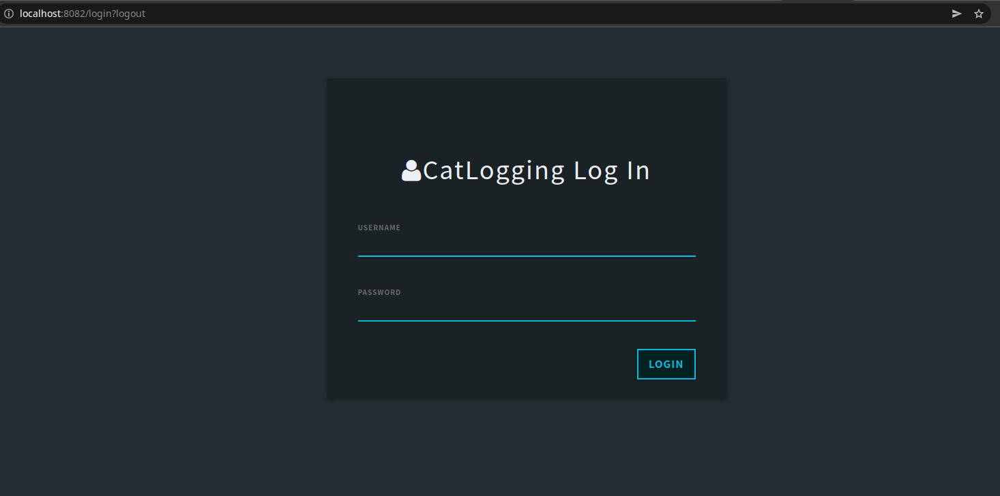

## Quick start
1. start
```
    java -jar catlogging.war
```

2. Option Start (recommend)
```
    java -Dcatlogging.validationPath=/ -Dcatlogging.home=/home/catlogging -jar catlogging.war
``` 

## Documentation

- ENV : Linux x86
- Add Support i18n(en, kr, ch)
- Add Support Log Validation path (For inaccessibility of basic system path.)
- Change Dark theme UI

- Change SpringBoot 2.x App
- Enable Spring Secure

    - [properties] default web.servlet.session.timeout : 1800sec(30min) 
    - [properties] default catlogging.enable.auth : true
        - Whether or not to use the login function.
        Sometimes, in places where security is not necessary, you can set it to false for quick access. 
    - default username : admin
    - default password : admin
    
- PATCH : secure log4j(CVE-2021-42550)

## Develop Run

- Enable external tomcat Run (default embed tomcat 9.x)
- Enable SpringBoot 2.x Run
- Enable H2 Remote access. (default : false)

### H2 Connection Info 
- username : catlogging
- password : catlogging 
- url : jdbc:h2:tcp://localhost:9092/`opt:catlogging.home`/h2/catlogging

> Example
> ```bash
> jdbc:h2:tcp://localhost:9092//home/catlogging/h2/catlogging
> ```
